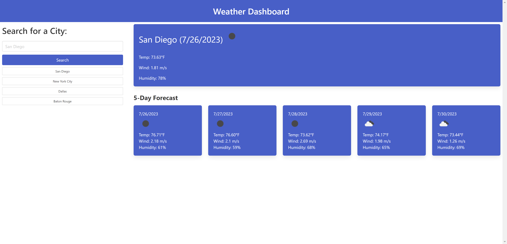

# Weather Dashboard

## Description

This web application was created to allow a user to see the current 3-hour weather forecast as well as the forecast for the next five days of a specified city. The application also stores the history of cities in local storage so that the user can click on their history and see the results again. The forecast shows the date, an icon indicating the weather, the temperature, wind speed, and humidity. 

## Installation

N/A

## Usage

The user can click on the Search bar on the left hand side and enter the name of a city. The forecast will appear after they enter the city name and click the Search button. They can also click on their search history under the Search button to bring up previously searched forecasts.

## Credits

N/A

## License

N/A